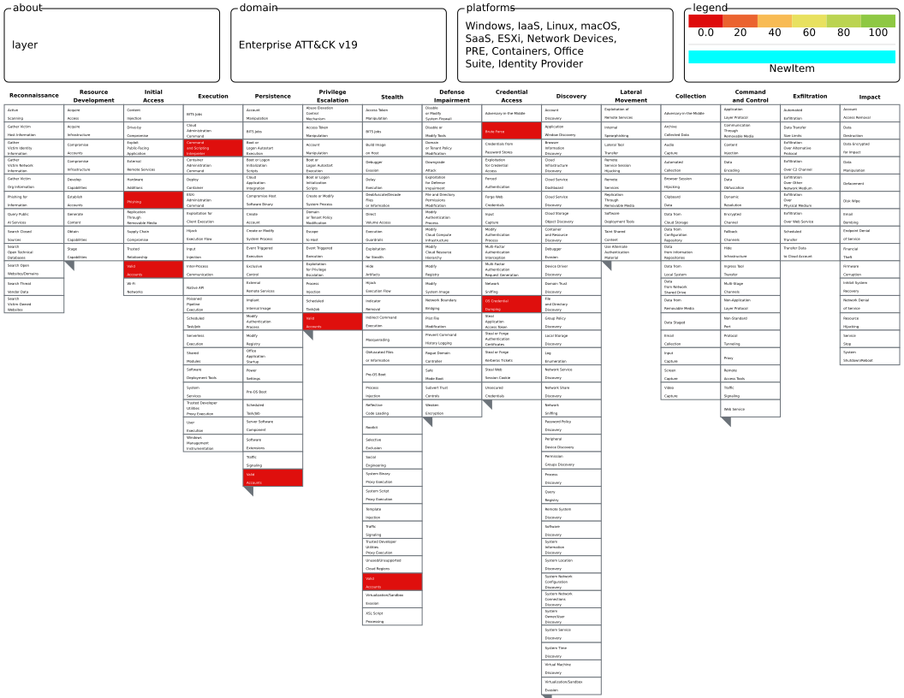

 

# MITRE ATT&CK Coverage Map — Day 8

**Date:** 9th June 2026  
**Analyst:**   Ameda Natasha
**Framework:** MITRE ATT&CK Enterprise

## What is MITRE ATT&CK?

MITRE ATT&CK is a globally recognised knowledge base of adversary 
tactics and techniques based on real-world observations. It is used 
by SOC analysts to:

- Map alerts to specific attacker behaviours
- Identify gaps in detection coverage
- Communicate findings using a common language
- Build detection rules around known attack patterns

The framework is structured as:

**Tactics** → the *why* (what the attacker is trying to achieve)  
**Techniques** → the *how* (the method used to achieve it)  
**Sub-techniques** → a more specific variation of the technique

## The 14 Tactics (Defender's Kill Chain)

| # | Tactic | What the attacker is doing |
|---|--------|---------------------------|
| 1 | Reconnaissance | Gathering information before attacking |
| 2 | Resource Development | Setting up infrastructure |
| 3 | Initial Access | Getting into the environment |
| 4 | Execution | Running malicious code |
| 5 | Persistence | Maintaining their foothold |
| 6 | Privilege Escalation | Gaining higher permissions |
| 7 | Defense Evasion | Avoiding detection |
| 8 | Credential Access | Stealing passwords and hashes |
| 9 | Discovery | Learning the environment |
| 10 | Lateral Movement | Moving to other systems |
| 11 | Collection | Gathering target data |
| 12 | Command & Control | Communicating with attacker infrastructure |
| 13 | Exfiltration | Stealing data out of the environment |
| 14 | Impact | Damage, ransomware, disruption |

## Current Detection Coverage

Techniques I can currently detect based on skills built in Days 1-8:

| Technique | ID | Tactic | How I detect it |
|---|---|---|---|
| Phishing | T1566 | Initial Access | Header analysis, URLScan, AbuseIPDB, sandbox |
| Command & Scripting Interpreter | T1059 | Execution | Windows Event ID 4688, PowerShell logging |
| Valid Accounts | T1078 | Defense Evasion | Event ID 4624/4625 anomaly detection |
| Brute Force | T1110 | Credential Access | Event ID 4625 threshold alerts in SIEM |
| OS Credential Dumping | T1003 | Credential Access | Theory only — no hands-on detection yet |

## Current Detection Gaps

Techniques I have no visibility into yet:

| Technique | ID | Tactic | Why I can't detect it yet |
|---|---|---|---|
| Process Injection | T1055 | Defense Evasion | Need Sysmon + memory forensics |
| Lateral Movement via SMB | T1021.002 | Lateral Movement | Need network log analysis |
| Scheduled Task | T1053 | Persistence | Need Event ID 4698 monitoring set up |
| Data Exfiltration | T1041 | Exfiltration | Need network traffic baselining |
| Living off the Land (LOLBins) | T1218 | Defense Evasion | Need process tree analysis |

## Key Takeaway

ATT&CK is not just a reference document - it is a measurement tool. 
By mapping what I can detect today, I know exactly where an attacker 
could move through my environment undetected. Every gap on this map 
is a blind spot. Closing them systematically is what detection 
engineering is built on.

